# Final Write-Up Hack The Box
--------------------------------------------------------------------

## Obtaining an Account
After reaching the invite page I immediately examined the web page through the inspector tools providing by Google Chrome to see if any scripts were running in the background that could link to a invite code generator or hint at one. Within the inspector was a inviteapi.min.js script which caught my attention. I then opened up the file in the sources tab to insepct the code where there was a defined function called makeInviteCode that could be run within the Javascript console provided by Chrome. 

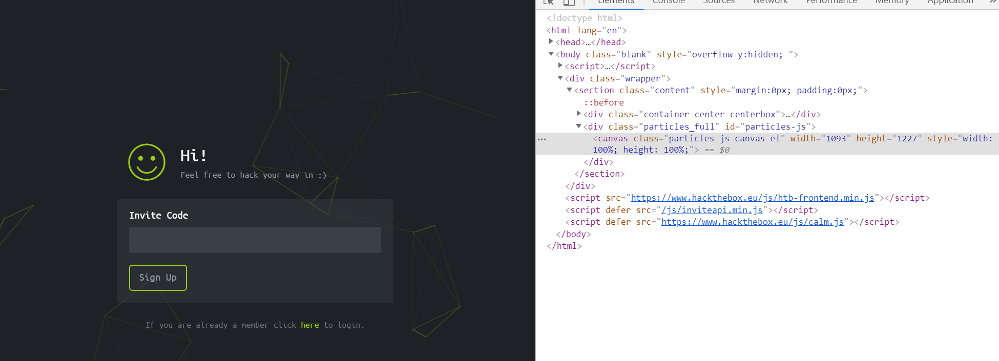
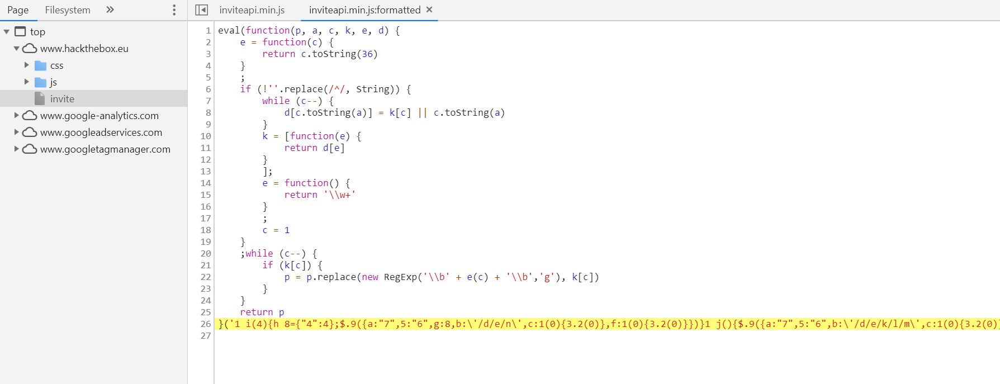

Knowing that the funciton could be ran I made call to it within Chrome using the built in console to see what output would be provided as a result. After running the result contain encrypted text which was encrypted using Base64 encoding scheme. Knowing the encryption scheme I copied the provided data and went looking for a text decoder that has Base64 as an option. 

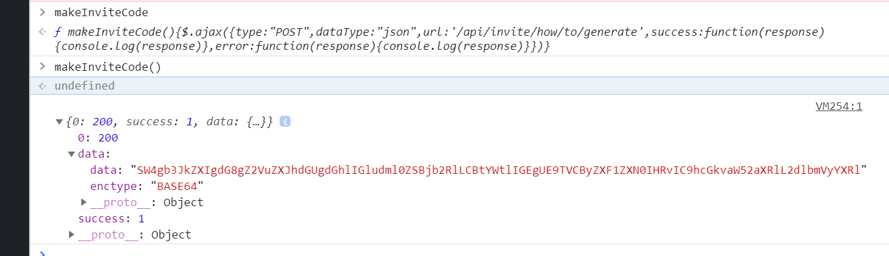

When I found a decoder I entered in the cipher text provided from the function set to decode from Base64 and let the decoder do its work. After being decoded the message stated 'In order to generate the invite code, make a POST request to /api/invite/generate'.

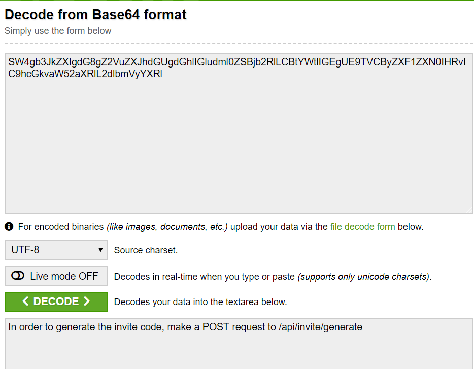

I then made a POST request following the format suggested by the cipher text and was provided the result below.

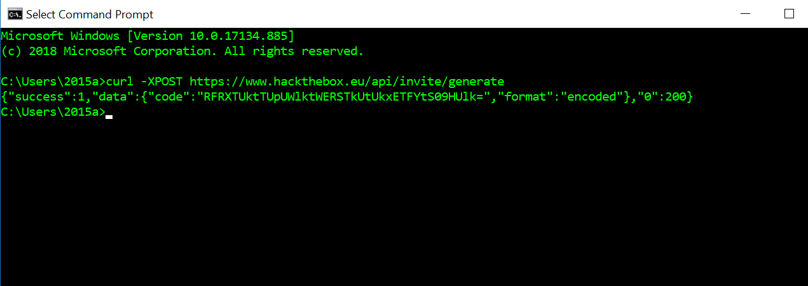

With the newly provided cipher text from the API used by 'hack the box' I returned to the decoder and decoded the cipher text from the API which in return gave me the generated invite code for the website. 

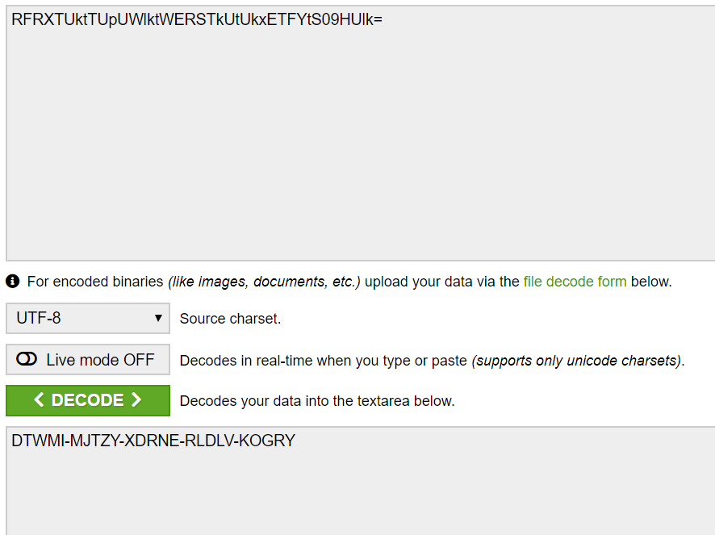

After entering my code I was able to register an account with 'Hack the Box' and continued to the challenges!

## First Challenge, Topic= Reverse, Name= Snake (10 pts)
Since I had no idea where to start I chose the first file which dealt with reversing challenges. I then chose the easiest listed challenge available so that I could get a feel for what the challenges in 'Hack the Box' would be like. Looking at the provided files I ran the python script in visual studio 2019 to see how the application ran. On run a prompt showed up as seen here:

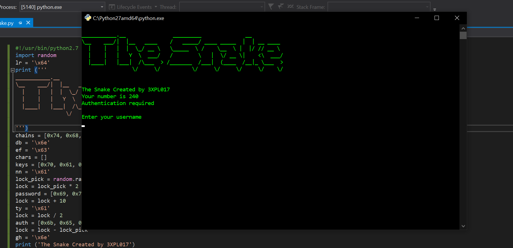

I then looked at the source code and saw that the inputs were being compared to two different variables one called 'slither' for user name comparisona and 'pass_input' for comparison with the password. Seeing the comparisons I looked at what information was being used to fill both viariables which were each filled with pre-determined string characters. This lead me to believe that before each prompt I could simply print the username and password necessary to complete the challenge. 

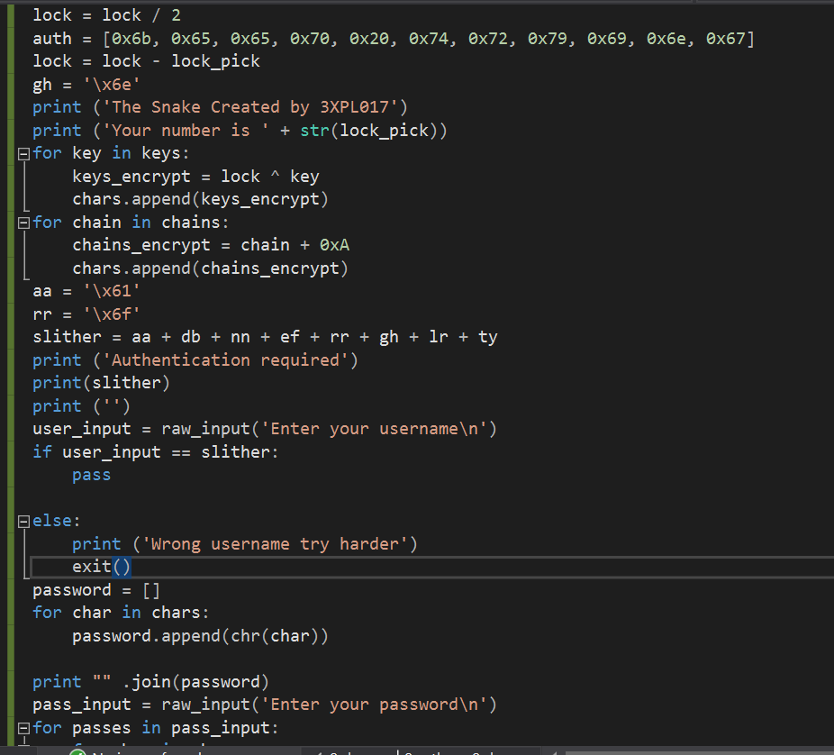
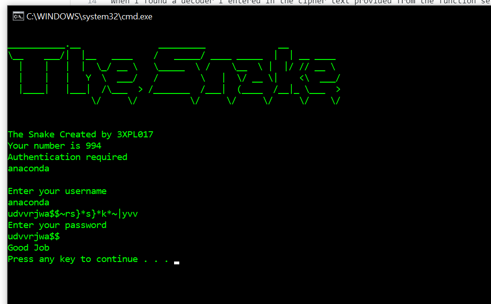

Low and behold it worked! with the username and password printed I was able to complete the challenge since I need the usernamen and the first ten characters of the password to pass the flag input for the challenge. Taking in the known parameters I passed in the flag with corresponding syntax and passed the challenge. Overall this challenge was very easy but was a good intro as to the difficulty rating in hack the box. 

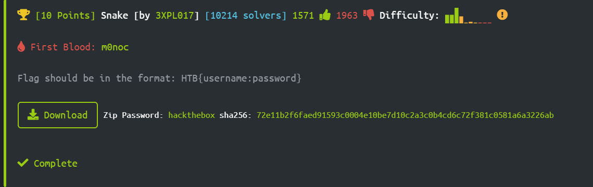

## Second Challenge, Topic= Web, Name= Emdee five for life (20 pts)
For my second challenge I moved over to the Web category and came across the 'Emdee five for life' challenge which has the user start out by running a docker instance in order to run the application. On spinning up the instance and connecting to the URL plus port number via HTTP you are presented with the web application presenting a mixture of characters and stating to submit the md5 hash of those said characters. 

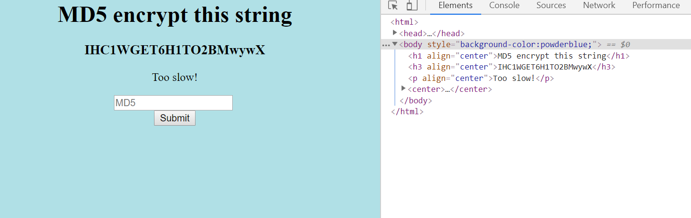

I did as follows but had the feeling that it would not work since being a challenge it could not be that simple and on point with my instinct the site presented me with a warning stating I was to slow to respond (seen in the image above). Fromt that prompt I decided to make a little python script that would connect to the docker session, read the presented characters, hash them with md5, and submit the hashed characters within a small time span so that I would pass the challenge. In my script I connect to the docker instance URL with port number read the header containing the characters then encode with utf-8 so that I can then hash with md5 to get the required submission. On running the script I was then presented with the successful response!

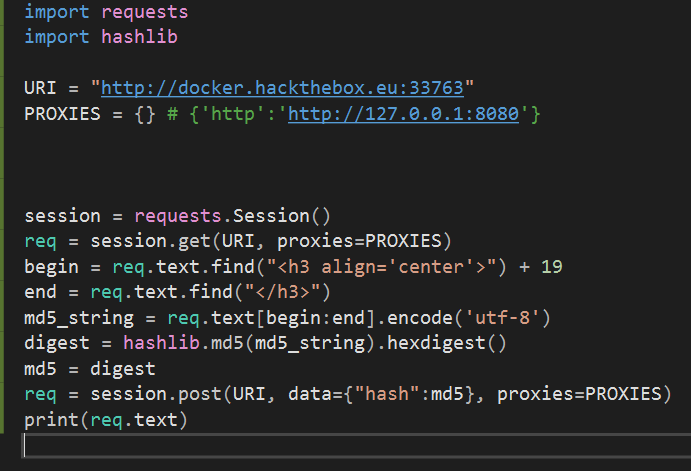
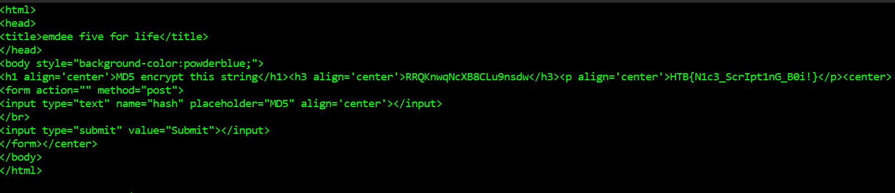

Following the success with the script I then submitted the response text which is the required flag response for the challenge  which as a result fully completed the 'Emdee five for life' challenge. Overall this challenge was pretty straightforward for me and having experience with web/mobile application and python I had a quick thought solution which ended up working very well for this challenge.

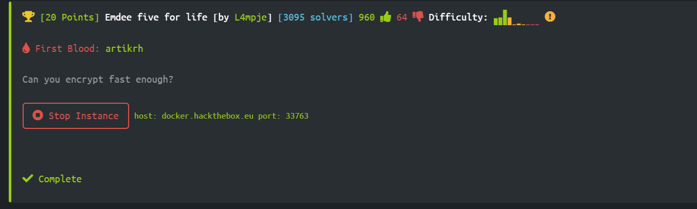

## Third Challenge, Topic= Reverse, Name= Find The Easy Pass (20 pts)
Starting out with the 'Find The Easy Pass' I downloaded the provided folder and extracted the contents. Within the folder was a simple application file which on run would prompt for a password and just to see how the application would respond I submitted 'password' which as resulted in a error prompt.

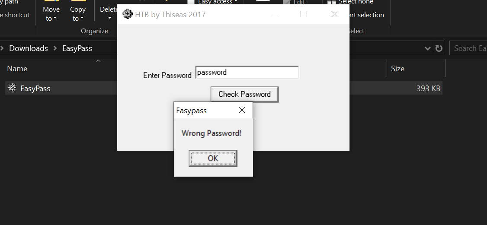

Seeing that the file provided is an executable I opened up Immunity Debugger which I had installed on my system from debugging assembly in former courses I have taken such as Operating Systems 2 and an advanced assembly course. I then opened up the application within the debugger to analyze what was being done with the input and if it was being compared to a predetermined password. 

Immunity Debugger: A debugger with functionality designed specifically for the security industry which includes usability features such as writing exploits, analyze malware, and reverse engineer binary files. Immunity debugger also includes the mixture of a GUI and CLI within one package a long with Python integration to automate debugging needs and scenarios. 

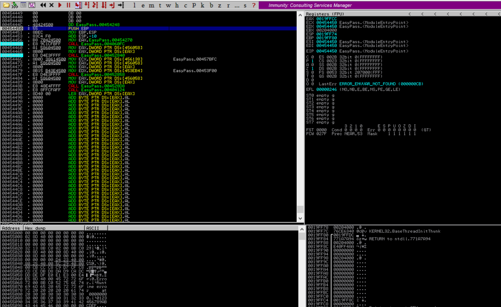

After looking further into the assembly I noticed while scrolling up that there were two strings that would be printed out after a call to a certain subroutine within the solution. The largest hint was when the EAX and EDX registers (EAX and EDX are commonly used for logic work) were being filled with information before a call to a subroutine which on return would result in the printing of either text based on the scenario. Realizing this I set a breakpoint at the call to see what values were present in the registers. 

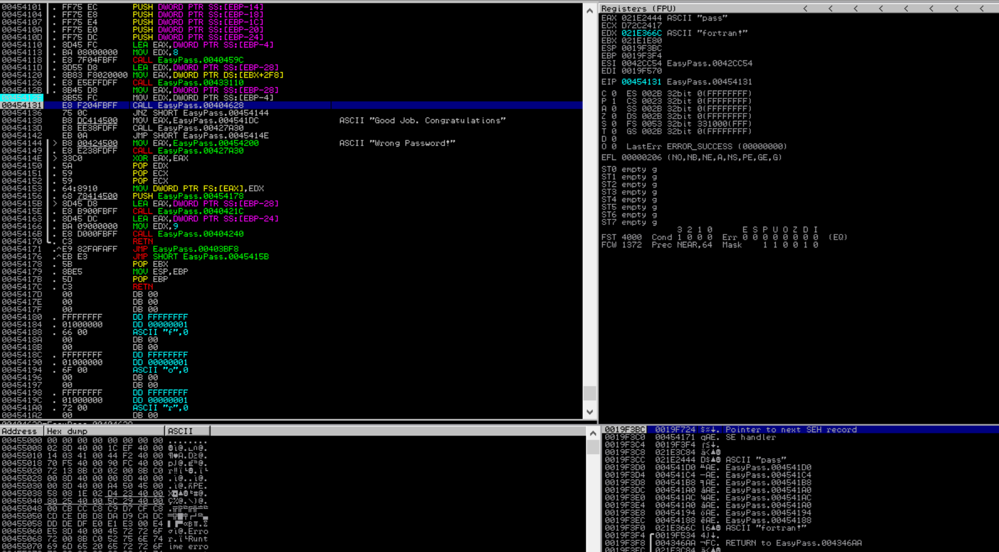

Looking at the registers in their respective window (top right window in Immunity Debugger) I realized that the password I provided 'pass' was present in the EAX register while the EDX register was used to hold the set password for the application by which would be used for comparisons. within the EDX register was the string 'fortran!' which I then submitted into the application which resulted in the successful response we were looking for.  

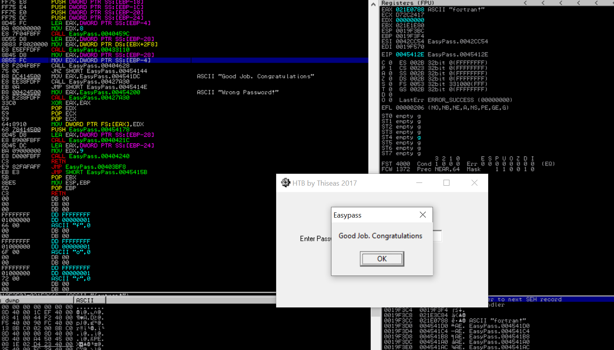

Following the success with the program I then went back to 'Hack the Box' website to input the necessary flag input in order to fully complete the challenge...success!! Overall this challenge ended up being very straighforward but I really enjoyed the debugging aspect that could be used in order to break down the assembly for this challenges solution. 

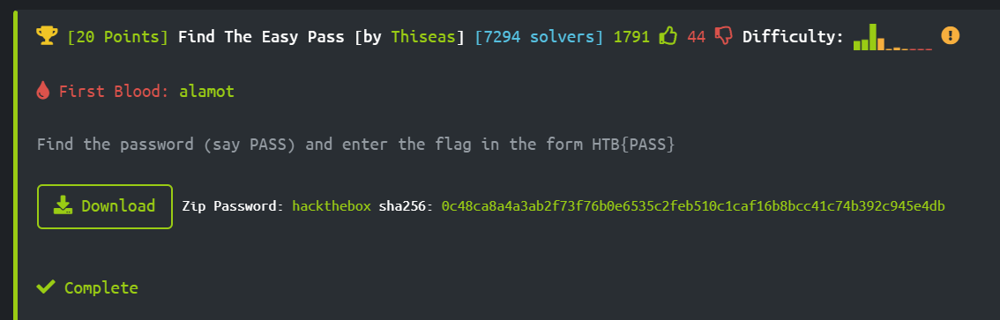
