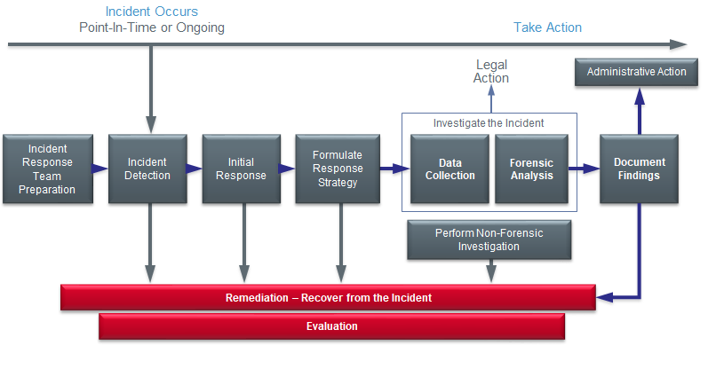
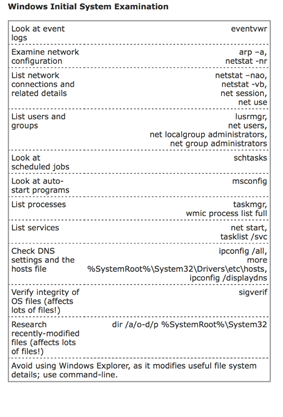

## Week 2 Write-Up
Week 2 introduced the topic of advanced forensics of systems/hosts presented by the director of threat intelligence at McAfee labs for a second week in a row. The lectures provided from our lecture were very interesting as well as relevant to today while showcasing useful techniques, tools, and industry standards that can be applied during our education a long with future career opportunities. The lectures this week also provided the opportunity of working with memory dumps/analysis including the challenge of scanning a usb device from a Korean defactor. 

### An Overview of Forensics
According to the lecture slides "Forensic Computing is the process of identifying, preserving, analyzing and presenting digital evidence in a manner that is legally acceptable”. (Rodney McKemmish 1999) Within the realm of computing forensics there are three areas of analyses known as live forensics, post-mortem based forensics (memory/disk), and network based forensics for data collection of cases. The process of forensics breaks down to evidence acquisition, investigation plus analyses, and reporting results while following four essential principles which are:
1. Minimize data loss
2. Record Everything
3. Analyze all data collected (evidence)
4. Report findings

Following the defined investigation structure (structure image below) will allow for effective preparation, detection, response, strategies/tactics, and results for cases. During the investigation acquisition of data is crucial and can conist of virtual/physical main memory, drives or partitions, and any traffic over a network (intranet/internet). While collecting data (evidence) it is important to follow the guidelines of not interacting with a live system (alters the natural state of the evidence), powering down a system can destroy evidence, and when collecting evidence you should collect in the order of volatile to less volatile. 

### Memory Volatility Scale in a Typical System (Top to Bottom = Most Volatile to Least Volatile)
- System Memory
- Temporary File Systems 
- Process Table & Network Connections
- Network Routing Information & ARP Cache
- Forensics Acquisition of Disks 
- Remote Logging & Monitoring Data
- Physical Configuration & Network Topology 
- Backups

### Memory Dumps
Dumping the contents of main memory (a.k.a. RAM) is critical for forensics analysis since a host of information is held within RAM during the running of processes or modules (running or exited). RAM can also contain hidden values utilized by the operator of the attack on the system or machine. Some information that can be detained from main memory is running processes, modules/DLL's, drivers, kits, open files, open registry keys, open network sockets, decrypted data, and so on. Having knowledge of operating systems can be very helpful when dealing with memory dumps as processes including files are broken in memory chunks both virtual and physical whose size are dependent on the host operating system. For example, the lecture slides stat that Windows allocates 4 GiB of virtual space for each running process on a host. In terms of physical memory, each process can be divided into mutliple 'pages' (dependent on size) across other address spaces. When handling dumps there are a few ways to enumerate through information which are:
- Looking for a printable string 
- Reconstruct internal data structures
- Search for static signatures of kernel data structures

While manual analyses is useful there are also some tools/plugins that can help with malware related to memory volatility which are:
- malfind: discovers injected code and DLL's
- svcscan: plugin that lists out running services
- ldrmodules: plugin that will look for hidden DLL's
- impscan: identifies calls to APIs without parsing a PE's IAT 
- apihooks: finds API hooks in user mode or kernel mode 
- idt: prints the systems interrupt descriptor table 
- gdt: prints the systems global descriptor table 
- orphanthreads:
- callbacks: print an assortment of important notification routines and kernel callbacks
- driverirp: print a driver's IRP (Major Function) table
- psxview: helps you detect hidden processes by comparing what PsActiveProcessHead contains with what is reported by various other sources of process listings.
- ssdt_ex
- ssdt_by_threads

 For more information on the plugins please follow this link https://github.com/volatilityfoundation/volatility/wiki/Command-Reference-Mal for the github repo for the code as well as wiki to learn more about these tools. However, should you find yourself manually testing through the command line you can look at the listing below provided by our lecturer on useful windows commands for live response/analyses when obtaining evidence. 
 
 

### More Than Just a Technical Battle
One of the major learning pieces I took from this lecture was that security and malware is more than just technical details. During the presentaions the lecturer provided discussion points through real life examples where he or others he has known had to handle evidence in cases such as child trafficking along with other imagery that could mentally disturb analysts. The lecturer discussed how a number of known colleagues had moved on or retired from the industry due to the severe cases dealt with and the mental fatigue that occurred due to dealing with such extreme situations/evidence. I think discussing the human psychological aspect of a security/malware career was a great move by the instructor because it is easy to get lost in the technical details of a field therefore we should make sure to note the other aspects of a career that present themselves. From a students perspective I found this information invaluable as we can move on in our college education with the added perspective that despite being in such a technical field there are other factors to be aware of that can affect us on a mental/emotional level and we should make sure to tend to all aspects of our life. 

### Week 2 Conclusion
Week 2 provided very interesting modules and learning materials where we were able to learn about an effective investigation forensics process/structure while being introduced to forensic tools that we were able to play with and learn. One of the most valuable aspects of this week was the labs where we were able to inspect memory dumps as well as implement forensic tools to real life cases as these opportunities provided great learning experiences with industry used tools as well as gave us experience on how to effectively gather/inspect evidence found from suspect hosts/systems (sometimes the simplicity of analysis that occurred if you had a wide range of knowledge too). Overall, week 2 was a great introduction and dive into advanced forenisc analysis!  

