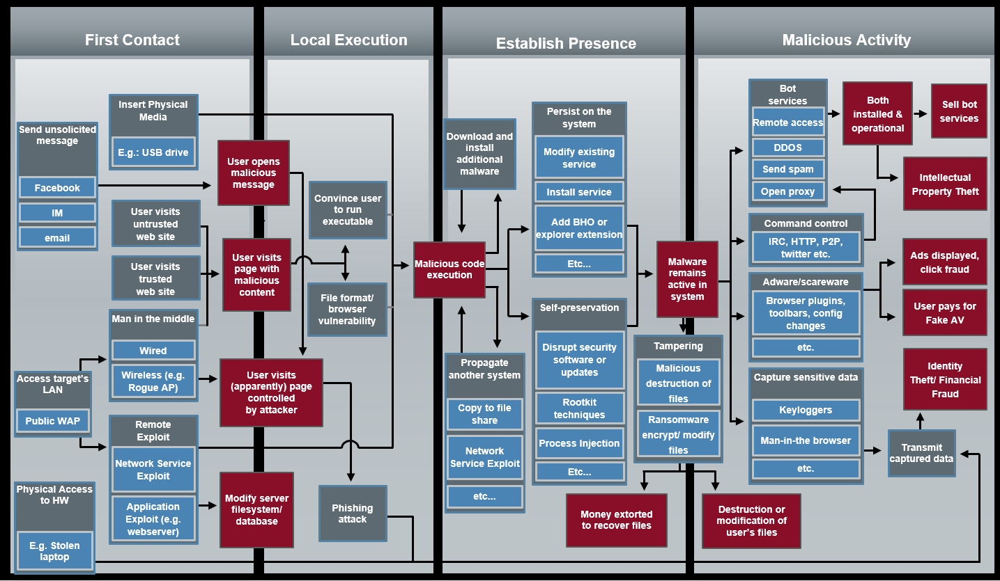
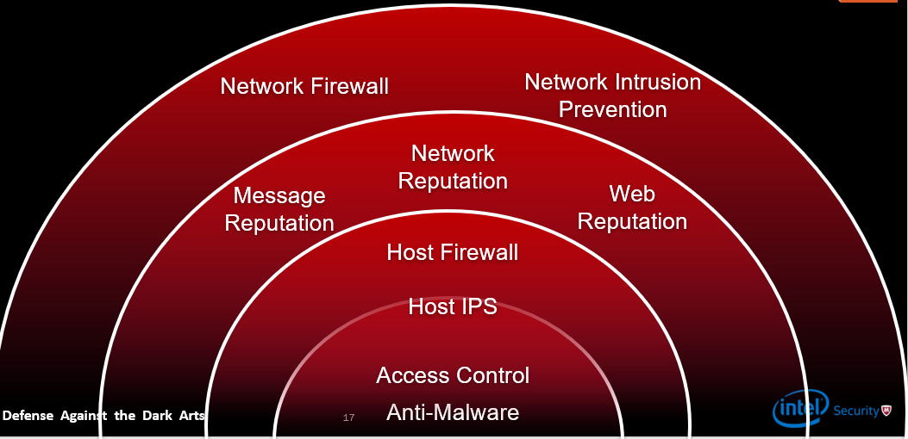
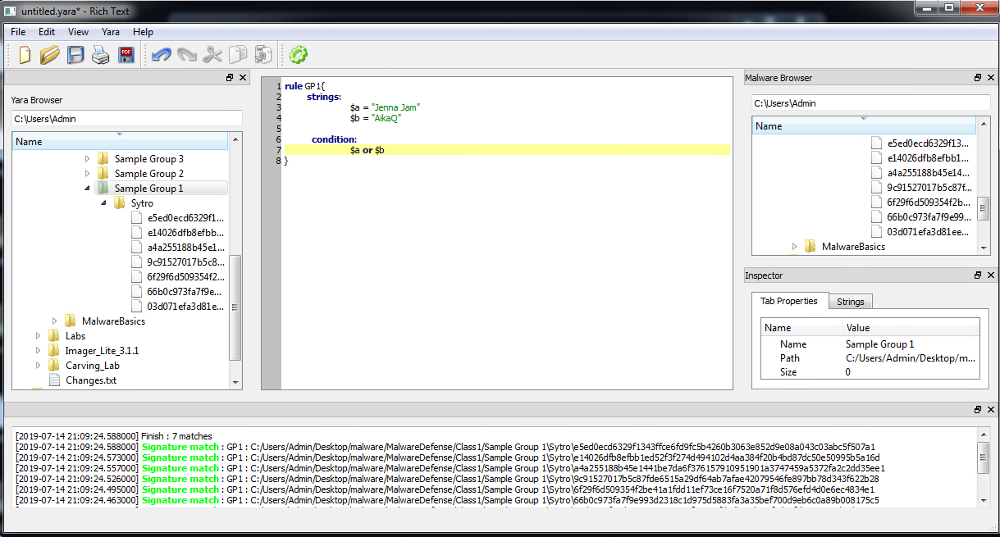
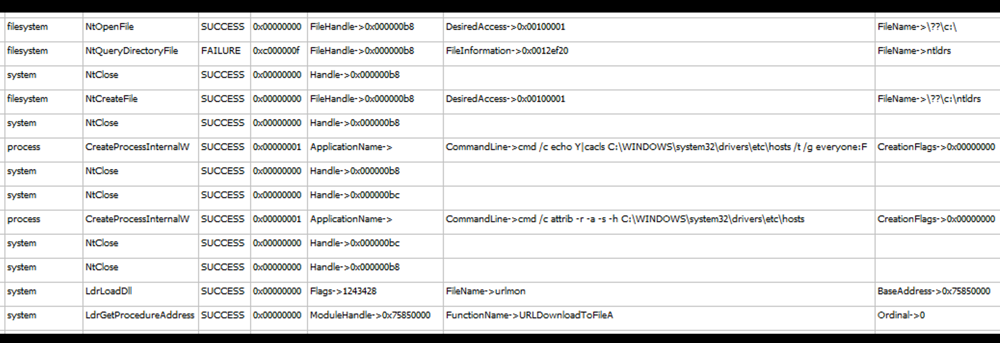
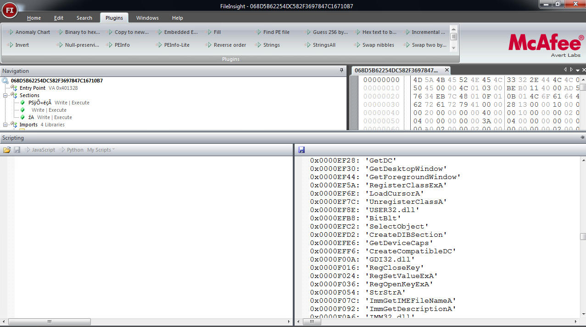

## Week 3 Write-Up
Week 3 provided an introduction of malware defense presented by Craig Schmugar a security speicalist at McAfee. Material for the week consisted of malware first contact, detection, defensive tactics dependent on attack vector, signature analysis, and attack flows. Included in the material was a lab which utilized Yara which itself provides a rule-based approach to create descriptions of malware families based on textual or binary patterns. We also were introduced to the Cuckoo malware analysis tool which is used to create a sandbox for executing malicious files to study and understand malware. Following I will discuss in detail the material that was covered in week 3. 

### Malware Procedure 
Starting off the presentation was the overview of the steps malware takes to infect a desired host and/or system. Understanding the procedure is a building block in defense as providing the best defensive practices requires having knowledge on both sides of the playing field. General malware behavior steps are depicted in the diagram seen below (image provided by Craig Schmugar):

 

#### Malware Procedure Steps
1. First Contact - The medium or style of interaction utilized by the attacker to gain attention of a user so that the user will interact with the malicious software that is being presented which in cases can be through email, instant messaging, malvertising, poisoned search results, and physical access to a system. 

2. Local Execution - After establishing contact with the user local execution is acquired by the running unknowingly run an executable through a button or applicaiton. Local execution can also happen through browser exploitation via browser-based exploit kits or abusing features that are known on various software applications or even operating systems.

3. Establish Presence - Following execution the malware will then begin to establish itself on the victim machine or system that interacted with it. Common malware presence tactics consist of utilizing operating system like file names or path schemes, adjusting time stamps to appear legitimate, or using signed binaries. Malware can use the previously common strategies through kits developed for malware for an automated process to hide from the user. When the malware has a desired presence it will then develop a persistent state within its desired host so that it can continue its behavior during a system startup, operating system startup, application startup, or other scheduled tasks without having to run execution again to establish another presence. 

4. Malicious Activity - The goal for the malware through the entire process was to reach this step in its behavior where it now begins to either search for sensitive information on the infected host or utilize the infected host to run processes or even use the host as another machine within a botnet/bot services. Some specific activity consists of an infected system being used to send spam, remote access onto other hosts, help with DDOS attacks, support adware/scareware/malvertising leading to user paying for advertising fees, and user sensitive activity such as a keylogger along with others. 

### Malware Defense Practices
Due to the dangers and constant rise of malware there have been a number of popular practices and technologies developed to help secure systems or prevent/minimize damage from malware. One of the most popular practices is establishing a network firewall developed around policies and security rules so that machines within a local network are protected from malware located on on outside newtorks (usually the internet). A second common practice is evaluating message/network/web repuation among various software packages, providers, and systems so that you can utilize those products which have a high reputation among other users or companies. On the user level you can establish a host firewall which controls and limits various network traffic to a specific machine as well as integrate access control along with anti-malware for host scanning and prevention of malware behavior. A diagram that sums up these practices can be seen below depicting a network to user/machine level prevention practices. 

 

### YARA & YARA Lab
YARA is a tool aimed at helping malware researchers to identify and classify malware samples. With YARA you can create descriptions of malware families based on textual or binary patterns. Each description, otherwise known as rules, consists of a set of strings and a boolean expression which determine its logic. Within a rule set strings can be set by nocase (case insensitive), wide (strips zero in unicode), wide ascii (searches wide and ascii strings), fullword (full delimited strings), byte patterns (hexadecimal strings), and wild cards which are "?" or "??" syntactically. Within YARA there is a rule browser and generator, code editor to develop rules, malware browser, and an inspector to gather information on samples. 

The YARA lab consisted of utilizing the environment provided by YARA to evaluate a group of files and find uncommon strings being found between files so that we can classify files into various categories or families. The lab contain three groups of files to search for strings and were located in the following directories:

- C:\Users\Admin\Desktop\malware\Malware Defense\Class1\Sample Group 1
- C:\Users\Admin\Desktop\malware\Malware Defense\Class1\Sample Group 2
- C:\Users\Admin\Desktop\malware\Malware Defense\Class1\Sample Group 3

Within the YARA editor you can select these directories and generate rules in the code editor provided in the YARA environment. After further string matching and rule generation you can continuously execute rules to see how many matches have occurred with your created rules for those specific files. Below is my sample from the lab for group 1 showing a rule that matches across all files. 

 

After successful matching those can then be classified into any form that is necessary or hase been set by policy. The same procedure can be used for sample groups two and three for string analyses which each have their own unique strings to discover and categorize but for length I will keep my first sample up since they are quite similar in terms of the process. 

### Cuckoo 
Cuckoo is an automated malware analyses tool that can be used to determine the behavior of malware without harming an actual host. Cuckoo achieves its usage by providing a sandbox to isolate a realistic environment to process the behavior of some chosen malware file. Should you not use the provided sandbox Cuckoo can still be used within a set environment to analyze the behavior of malware. Cuckoo can also provide other uses to security specialists such as tracing API calls/behavior of files, dump and analyze network traffic (even if it is decrypted), and perform advanced memory analysis of the infected virtual sandbox system through volatility as well as on a process memory granularity with YARA. When Cuckoo completes analysis of the malware it will provide logs in the form of csv files which provide a flow of events that occurred during the malware process (image of results below). 

 

## Blog - Chinese Keylogger Stealing User Sensitive Data On Infected Machines
*Author: Lorenzo Ayala*

*Sunday, July 14, 2019*

*Malware Hash: 068D5B62254DC582F3697847C16710B7*

With encrpytion becoming a popular approach to hiding the static/dynamic contents of a malicious file, security analysts jobs have become much more difficult due the added approach of decrypting those files. However, shoulder an attacker take a lazy approach to malware such as the file hash analyzed for this article a simple analysis can be conducted to search and understand the behavior of malware being deployed. Users should also educate themselves in the best practices to follow when utilizing sources from unkown providers otherwise they could be harmed by the trojan analyzed for this blog. 

#### String Search/Analysis
Starting off the analysis was a simple string search in the file to see what strings were present and could be possible links to malware. Within FileInsight I opened up the file and searched through the file to find uncommon strings that could possibly suggest malware presence/behavior. After processing in FileInsight a number of uncommon strings were found and consisted of "wm.ime","QQLogin.exe","GetTuPian.asp", "DNF.exe", “RegSetValue”, "RegOpenKeyExA", "RegCloseKey", "Keyboard" along with various other suspiciously named strings. 

 

#### Malware Behavior Analysis & YARA Signature
With the known found strings it was a quick guess that the malware was most likely (if installed) setting registry values related to a machines keyboard to create a keylogger. When setting up an environment with Cuckoo and FakeNet I ran the file wm.ime to allow analyses of the malware. On completion and look at the Cuckoo logs the wm.ime file would read two other files, add a registry key with value E0200804, add the new key to the keyboard layouy preload key directory, and then install a batch file to the system. After completing its set up the malware would then set up an http connection to 'http://%s:8080/pobao/GetTuPian.asp' which is most likely an attackers server to store the logs from the keylogger on the host machine. Based on the analysis I then set up the following YARA signature to determine if a machine has been infected with the malware:

```
rule KeyLog{
      Strings:
               $a = "wm.ime"
               $b = "QQLogin.exe"
               $c = "GetTuPian.asp"
               $d = "DNF.exe"
               $e = "RegSetValue"
               $f = "Keyboard"
      Condition:
               all of them
}
```

should a match happen on your system then you can then delete the "wm.ime" file from your system and delete all keys with the value E0200804. 

