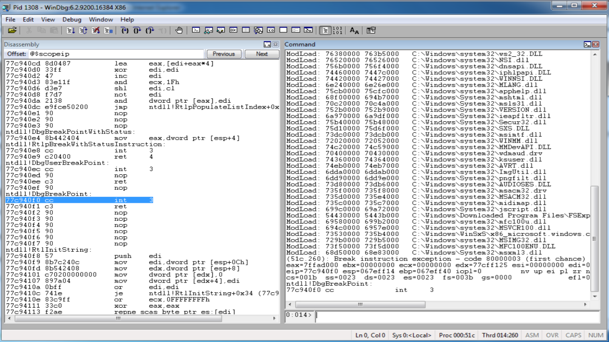
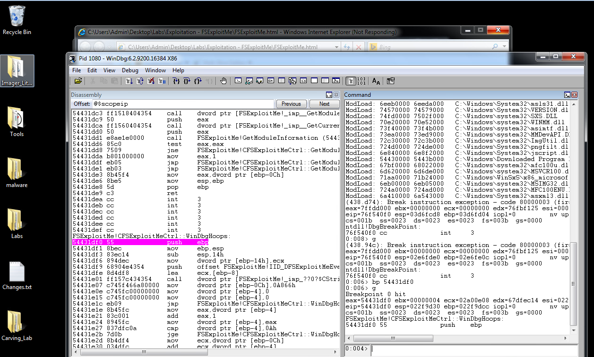
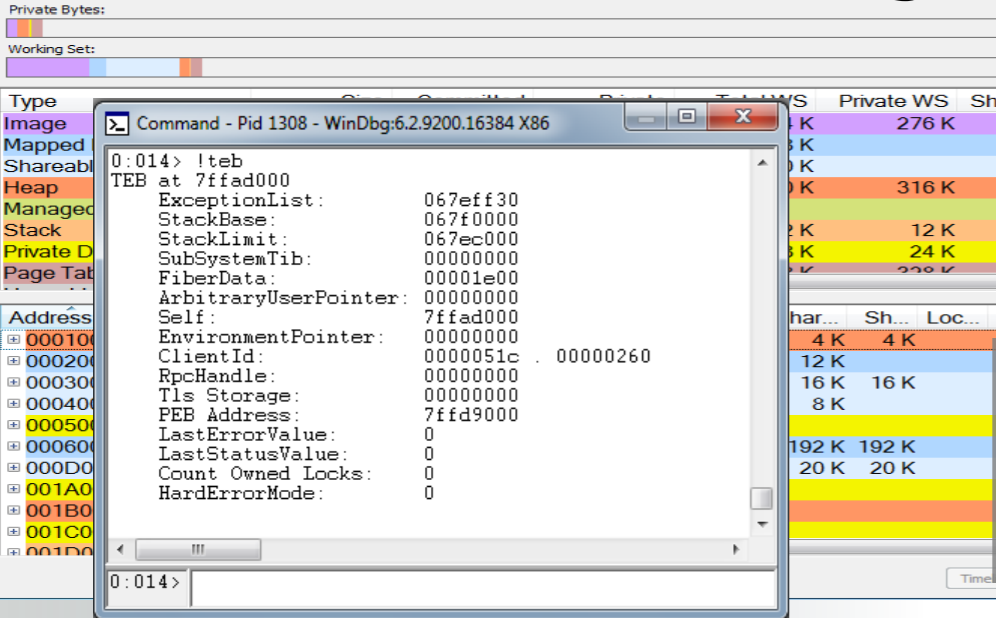

## Week 4 Write-Up
Week four focused on content provided by Brad Anton. The lecture consisted of hacking trends in the industry, exploits, using WinDBG as well as stack/heap overflows. Content for week 4 introduced the contextual growth of hacking along with the rising trends that are increasing based on software implementation in the industry and how those weaknesses (some discussed in lecture content) can be exploited for both good (ex. bug bounties) or for personal gain.

### Hacking in Layman Terms
One of the standpoints provided by Brad Anton was that hacking, in simple terms, is just manipulating code in a manner the leads to unplanned behavior or an individual taking advantage of the behavior/misconfiguration. Brads viewpoint to me was a great way to start since most of the time in the field of computer science we can get so caught up in the details of our work that this viewpoint really brings us back to the simplicity of what we are doing, however, its how it is done that introduces the complexities that are seen now. I also enjoyed the evolution of hacking from Brad's perspective of hacking and how it has evolved into a much more serious topic over time as both hardware and software developed. Brad states that in the early days hacking was a relaxed hobby where many enthusiasts simply messed with systems as a way to learn rather than most days where hackers have become infamous for utilizing system weaknesses for some form of personal gain. The introduction was a great way to really breakdown the simplicity of what we are doing and how such a topic can grow from a small hobby to a very serious aspect of every day life since software has been integrated into so many activities of our life. 

### WinDBG 
Following the simple layout of concepts was the introduction of WinDBG (pronounced win-debug) which is a multi-purpose debugger provided by Microsoft for the Microsoft Windows operating system.  Use cases of WinDBG consist of debugging user mode applications, device drivers, and the operating system itself in kernel mode. unlike some other debuggers such as GDB (GNU Debugger) WinDBG provides a graphical user interface to provide usability to its target users. Popular applications of WinDBG is analysis of memory dumps during a crash of the applications listed in the common use cases of WinDBG. Analyzing an application that has crashed is the main goal in using WinDBG as reaching a crash point in an application leads us to the expectation that we have reached some point of unexpected behavior or perhaps bad practice that has led to poor configuration. WinDBG thus allows us to step through the program using a command line (with various commands) within the GUI (graphical user interface) to dump values within registers, step through lines of execution, view opcodes/operands, and much more. WinDBG also includes the use of extensions that have been developed to help users in analyses by implementing features helpful in dissecting common use cases among core users. Below is the WinDBG GUI and some useful commands within the command line interface:

 

- View Memory: du, da, dd
- Stepping: t, p
- Breakpoint: bp (some address)
- Address: !address
- Help/List Commands: .help 
- Attach Process: .attach
- Math: ?(some expression)
- Process: !peb
- Thread: !teb 


### WinDBG Labs
The labs for WinDBG were a fantastic way to get introduced to the debugging system and its GUi as well as its command line instructions. The lab involving IE processes was particularly intriguing as it provided the opportunity to take the new found knowledge and apply it to an issue that occurs on an online application that has crashed when we set a breakpoint and execute to that point:



Upon crashing I then realized that the program was using heap data at this particular assembly operand and therefore used the command ```!heap -p -a ``` with necessary arguments to filter out what data was being transacted on the heap (ex. function arguments) and the allocation sizes so that we can inject the necessary malware to manipulate system behavior through our Javascript code. After learning of the heap allocation we can then use Brad's provided Javascript file to alter the block of memory with the replacement block variable in the Javascript to alter the heap so that on execution we could pop the calculator through the shell program.


### Understanding at a Lower Level
Getting introduced to WinDBG provided us the knowledge that analyses of broken/crashed systems occurs at a very low level of the system most commonly assembly language correlating to a specific application or system. During lecture a brief period was used to provide an overlook into the construction of assembly which is based upon code functionality and how the construction of assembly can become a weak point within an application. Furthermore based on each function a stack frame is produced for each function along with its argument data necessary for process including the return address which is required to jump back to the programs starting point if a function is called. Knowledge of how a stack frame is constructed is vital in knowing how to manipulate a program through malware such as payloads via javascript or just for analysis with WinDBG for deconstruction on a lower level (in image below). Having a look at how assembly construction occurs is a good way to really bring in the entire picture that as we develop applications or systems we should be aware of the lower level of construction that occurs and how a machine interprets that assembly for execution. 

 

### Flaws and Overflows
Messing around with WinDBG for analysis provided us the opportunity to discuss and look at flaws that are apparent today and overflows (stack & heap) that are utilized to gain control of a program through said flaws. Common flaws consisted of the following families by which they are categorized into:

- Configuration Flaw: inproper setup of some application, service, or system such as a weak password.
- Logic Flaw: A design flaw of some system that can be manipulated like soft authentication.
- Storage Flaw: An issue in protecting system storage or not properly storing data such as sending plain text for storage. 
- Input Validation: Flaws where a malicious input can gain access to a system or corrupt it. (ex. injections)

Noting these families will be good for reference in the future for how we should handle each flaw we come by or that pop up during development while providing us a place to start in what may have caused such a flaw and where the flaw is within the system. Should a flaw be evident in a system we can then gain access to the memory of an application. Should an attacker gain access to memory they can then attack via a stack or heap overflow. A stack overflow occurs if the call stack pointer exceeds the stack bound which is usually determined by address space when a program is executed. Overflowing the stack will allow the attacker to insert assembly instructions or manipulate current instructions so that in response malware can be executed unexpectedly on the machines end. Most common attacks usually occur where attackers gain access to the memory then overtak the stack pointer so that it will then point to an address where their malicious code is located. A heap overflow is a buffer overflow that occurs in the heap data area which is dynamically allocated by a program. Should an attacker gain access to the heap if they can achieve access to an object or internal structure they can then begin to manipulate the program through data corruption. Brad introduced the tool "Page Heap" for WinDBG which was designed for heap analysis/debugging which is enable through gflags to free allocated memory (example code below) and then examine the current state of heap information. 

#### Page Heap Memory Free
```
0:005> !heap -p -a ecx
address 17beaff8 found in
_DPH_HEAP_ROOT @ 17801000
in free-edallocation (  DPH_HEAP_BLOCK: VirtAddrVirtSize)
                           17804068 : 17beaff8 2000
70a190b2 verifier!AVrfDebugPageHeapFree+0x000000c2
772165f4 ntdll!RtlDebugFreeHeap+0x0000002f
771da0aa ntdll!RtlpFreeHeap+0x0000005d
771a65a6 ntdll!RtlFreeHeap+0x00000142
757bbbe4 kernel32!HeapFree+0x00000014
```
### Week 4 Conclusion
Week 4 provided a great median stand point of analysis for malware. Handling various flaws allows us to analyze the issues from a defensive perspective to understand what is happening while understanding the flaws allows us to consider what style of attacks can occur when developing an application or system for production use. The labs were a great introduction to tools that are useful in debugging Windows operating system application while providing us the opportunity in examining flaws which give a learning that will be useful heading into our careers.  

