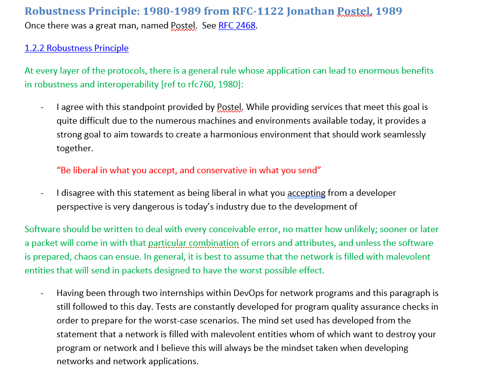
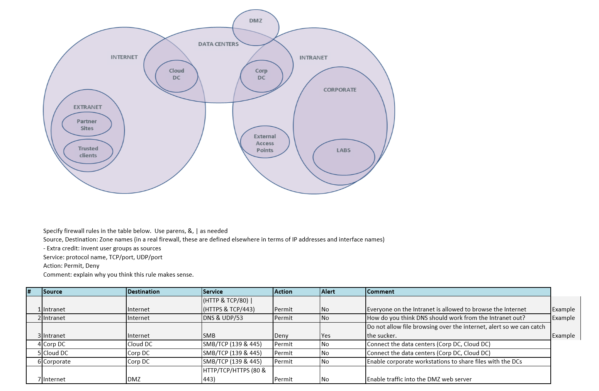
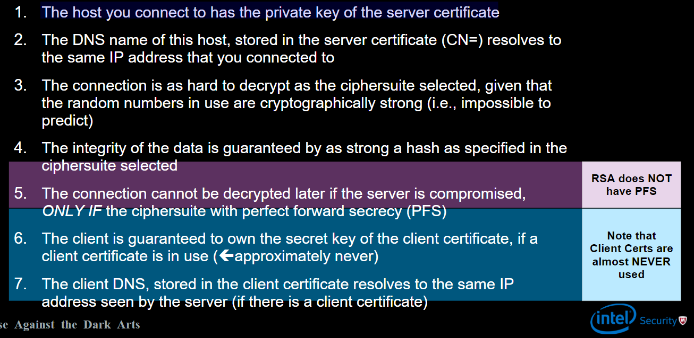
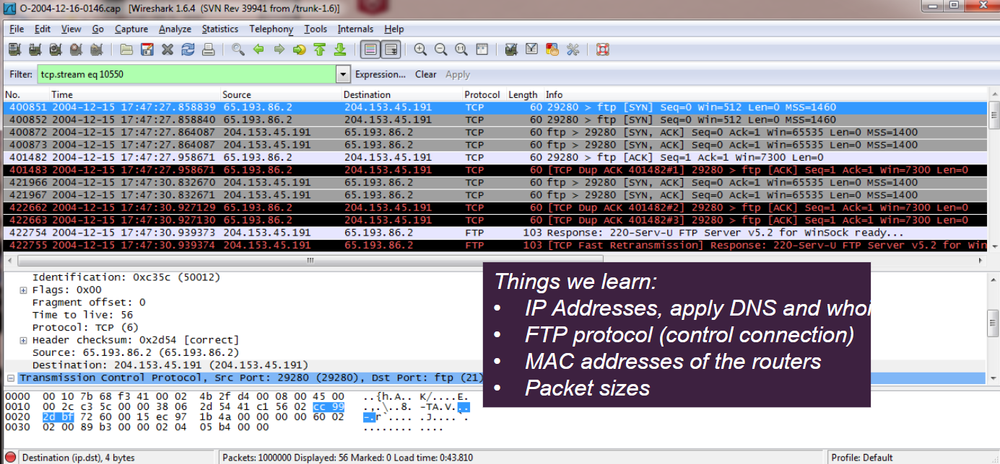

## Week 6 Write-Up
Week six was about network security and the numerous security implementations a long with networks. The week's contents were provided by Ram Venugopalan and Geoffrey Cooper of McAfee Security. Content for the week consisted of analyzing the Robustness Principle by Johnathan Postel which would heavily influence the development of networks including the Internet, network-based protection strategies/implementations, and network security topics related to network attacks as well as network information gathering. 

### Why Network Security is Needed
The first discussion point of the lecture was the importance of network security and its uses in today's industry. The key aspect is to help host-based protections by using the network as a safe zone by preventing dangerous hosts or data from entering any unauthorized areas which can help prevent exfiltration of critical data. Network security is also vital in preventing threats coming from and out on the networks which can consist of DDoS (distributed denial of service), attacks from network (ex. stack overflow, Morris Worm), Worms, Botnets, theft of network resources, and threat to critical infrastructure, espionage. With such a wide array of possible attacks it is easy to grasp as to why network security is such a strong implementation of many corporate infrastructures. 

### Robustness Principle Analysis

### Network-Based Protection Strategies

#### Positive Policy 
Positive policy is utilized to set whitelists of expected/allowed behaviors from hosts or files therefore allowing the network or admin to identify suspiciou activity a long with setting permissions. The fundamental concept then provides the network defender the advantage by utilizing internal conventions/policies on certain machines which in return reduce the range of attack choices of the network attacker. Positive policity can also allow introduce hooks for trust mechanisms such as identity or trust chaining and also provide detection mechanisms based on provided policies as well as whitelisted material. One drawback of just using positive policy is that it can not name a threat that has been passed in but just detect that some anomaly has happened.

#### Firewalls and Security Zones
The most common implementation of policy ina network is to define zones in the network with policy between the zones. Firewalls are devices that sit between the zones and filter traffic based on evaluating the functionality of network traffic and limiting the traffic based on the provided policies for that firewall. During their progression firewalls have grown to incorporate a number of functionalities to test policies against such as routing, NAT, and IPS which has lead to firewalls becoming a large entity in the realm of network security. Commonly used zones for firewalls are the Internet, intranet, testing labs, data centers, corporate, and DMZ. Firewalls are best implementing policies from IP address to IP address with the inclusion of other advanced concepts. 

#### Firewall Exercise

#### Defense in Depth 
The main concept of defense in depth is layering common or useful defensive strategies to create several layers of defense within a network so that one breach will not completely expose a network. For example, defense can begin at an ISP whom of which can set a firewall for their traffic which if passed will be presented to the network with the host requesting that data which itself could have a firewall that provides stricter policies of evaluation and then on the host you could implement policies to limit execution of files therefore making a strong filter to prevent unwanted behavior. Defense in depth was a great reminder that there is no one stop shop when it comes to security and that it takes numerous layers of security to create a safe environment for your users and yourself from harmful attacks. 

#### Intrusion Detection/Prevention Systems
Intrusion detection/prevention systems consist of any device or software that monitor a network or system for malicious activity or policy violation and are widely deployed in networks. Intrusion systems used the anomaly or bad signature to identify the malicious threat that it attempting to gain access or has already gained acces and can provide the means necessary to stop that attack on the network (especially if the attack in a well known attack). Intrusion systems can also become good resources in providing information on malware and what bugs/flaws they are targeting which have eventually led to the creation of virtual patching (now commonly called web application firewalls or WAF for short) which provide a quick solution to preventing the style of attack that was successful by banning that form of information from coming in. Some disadvantages of an intrusion detection/prevention system is zero day attacks and false positives that can be provided in an alert.

#### Honeynets/Intrusion Deception 
Honeynets provide a similar concept to a honeypot (discussed in week 1) by providing a fake network in the wild that is open to attack in order to catch malware since it is held within a machine for analysis, deception, or even wasting attackers time/resources. Honeynets can also be implemented in a sense that allows the developers to go back at the attacker by forcing downloads or some form of persuasion to get back at the opposition and learn more about the malwares sources. One major drawback of a honeynet is the expenses required to create one as a single machine must be integrated and maintained per network leading to a large amount of configuration time, however a number of vendors and toolkits have helped provide quick solutions today. 

#### Quarantine 
Quarantine is essentially placing the malware within a space or limit (enter sensitive data or money requirements) as to where it can no longer infect other machines in the network. Quarantining a malware is effective as it allows for analysis of the malwares behavior in the network plus simply removing the malware could result in another successful intrusion by the malware that could be uncaught therefore leading to technical debt for the network admins. Quarantine can also provide the opportunity of working with others to analyze malware that can be presented by users who are unaware of the malware they have introduced. 

#### Reputation 
Reputation evalutaion is a big data solution/implementation in network security as reputation can rely on a large set of data such as IP addresses associated with known malware developers, botnets, or spammers as well as URL classification and categorization with references to pages known to hold scripting attacks, drive-by downloads, and so on. File reputation is also important to recognize the legitimate nature of the source providing the file or if a specific file is know to carry common viruses or are included with virus implementation. 

### Network Products
Many of the previously discussed network security implementations have been deviced in to products that are used world wide from software companies that have developed technologies that incorporate numerous functionalities for effective network security. Going over the various functionalities present in each product was a nice reflection on the current state of modern network security and having previously been a information security intern I have witnessed first hand the implementation of the products and which are more commonly used due to their wide array of functionality. While there are some more common network products each network should be evaluated on what technologies should be incorporated based on use cases to ensure that strong security layers are provided. 

### Network Security Threats 

#### Threat: Man in the Middle Attack (MITM)
A man in the middle attack relates to the situation where a machine ("man") is between a network connection of two end points and is altering or reading the packets being sent by the end points to either gain information/access as well as even harm one of the end point users/machines. One unique attribute of the MITM threat is that it can be implemented for both good and bad use cases which are dependent on the approach taken by the opposer. 

In terms of harmful uses, MITM is commonly used for ARP (address resolution protocol) poisoning in which a malicious actor sends falsified ARP (Address Resolution Protocol) messages over a local area network. This results in the linking of an attacker’s MAC address with the IP address of a legitimate computer or server on the network. Once the attacker’s MAC address is connected to an authentic IP address, the attacker will begin receiving any data that is intended for that IP address. ARP spoofing can enable malicious parties to intercept, modify or even stop data in-transit. A second MITM threat that can occur is a TCP hijacking. A TCP hijack is an attack that spoofs a server into thinking it is talking with a valid client, when in fact it is communicating with an attacker that has taken over (or hijacked) the TCP session. In essence, a TCP hijack is a MITM attack with two phases as the attacker will first render the client useless in its connection with the server. After the client has been dealt with the attacker can then utilize the session to mimic themselves as the now dead client to gain access to the server with whatever use case or priveleges that was provided to the client. 

Helpfule uses of MITM consist of creating a terminating TCP proxy, HTTP proxy, mail proxy, and SSL (secured socket layer) MITM. A terminating TCP proxy will terminate TCP connections on one side then create a completely new connection on the other side between the two end points. The benefits of a terminating TCP proxy is that it will rewrite all headers so that an attacker can't transmit protocol attacks through a firewall and creating a new connection every time will allow repackage of TCP packets which will make efficient use of the packet size, remove overlapping segments, and retransmissions. An HTTP proxy will intercept all HTTP traffic on the network to verify the destination against a list of "dangerous" hosts  as well as detect and remove malicious Javascript or EXE files from remote sites from response. Mail proxies look over IMAP, POP3 and SMTP protocols to prevent sending of malicious executables while also looking for sensitive data being exfiltrated in the emails. Finally, there is the implementation of SSL MITM to intercept ssl in order to decrypt then re-encrypt (in front of a server, by sharing the private key and in front of a client, by spoofing the certificate) while using DNS MITM to fool the client into believing the certificate is valid. 

#### Detecting Man in the Middle
One of the main defenses and detection methods with MITM is to use an HMAC (a specific type of message authentication code involving a cryptographic hash function and a secret cryptographic key.) such as a cryptographic hash or pseudo random function so that you can detect a MITM as the hashed packet will have altercations on it that are noticeable. Should a HMAC be utilized it is useful to address the 'N' squared issue which can be avoided by using a shared secret which implements a public key to lock packet data and a users own private key to unlock the encrypted data.

#### TLS/SSL 
  Securing communications across a network can be quite difficult but with TLS/SSL (since TLS is now deprecated SSL will be referenced) there is a strong go-to implementation that has been utilized by millions, however, SSL is not perfect and should not be the only solution to creating security on your network as SSL MITM can be used to fool clients. Some guarantees that come with the use of SSL are (image provided by Ram Venugopalan and Geoffrey Cooper of McAfee Security):

While SSL provides a good stock option for network security it does have its vulnerabilities with one of the most famous cases coming to the surface in April 2014 known as the 'Heartbleed' vulnerability. The biggest lesson learned from 'Heartbleed' was the separation of data to mitigate risks which was uncommon as it can be an expensive option. 

#### Threat: Hidden Data Transmissions 
Hidden data across the network can occur from a number of sources which can range from simple misuse of tools to actual malicious behavior. One form of hidden data transmissions is a covert channel which is hidden from traditional network devices by working around implemented network policies or limitations. Covert channels can tunnel through secure operating systems and require special measures to control. Covert channel analysis is the only proven way to control covert channels. Another type of hidden transmission is legitimate channel misuse which consist of using improper ports/protocols, sending hidden messages within the viewable message, payload tunneling, overlapping IP segments, and so on. Finally, there is policy holes and limitations which can consist of aged policies that are no longer needed, network devices that are not expecting deep enough, tunneling that is not detected and encrypted traffic that is not verified by a proxy or checked via MITM. 

#### Threat: Reconnaissance
Reconnaissance can be either active by which the attacker wants to attack vulnerable machines on a network or passive by which an attacker is simply viewing data that is going across the network in order to learn/gain new information. For active reconnaissance one basic tool used is scanning in order to connect to a number of hosts or ports in order to find IP addresses and implemented ports. Some simple scans that can be run are a ping, TCP port scan, UDP scan, and so on. Passive reconnaissance as stated is gaining information which can pertain to tapping ISP's, hiding equipment for information gathering and even 'envelope' data which is inspecting connections to a site while mapping services like NMAP. Reconnaissance can be effectively done in wireshark as seen in the image (image provided by Ram Venugopalan and Geoffrey Cooper of McAfee Security):

In order to protect yourself from reconnaissance you should implement policies and deep inspection while possibly using honeynets to slow down the opposition. One exception is passive reconnaissance which can be difficult to protect a network from unless an admin utilized physical security or cryptography practices. 

#### Threat: Spoofing 
In the context of network security, a spoofing attack is a situation in which a person or program successfully masquerades as another by falsifying data, to gain an illegitimate advantage. Spoofing can consist of LAND attacks which is a DoS attack that is relient on spoofing. IP and ARP spoofing can be used for MITM attacks as ARP caches can be poisoned via this method. Predictive spoofing attacks handles TCP resets and TCP sequence number prediction to get through NAT's. 

Defense against spoofing can consist of simple checks across the network for detection and protection. Another form of spoof protection is reverse path filtering which protects against spoofed source addresses by causing the system to discard packets with source addresses that have no route or a route that does not point towards the originating interface.

#### Threat: Resource Consumption Attacks
Probably the most common resource consumption attack is a DoS (denial of service) or DDoS (distributed denial of service) attacks. A DoS attack is about consuming resources for an extended period of time such that the targeted service is degraded, some times to a point where it is unusable while a DDoS attack (harder to defend against) leverages large numbers of computers to perform one or more resource exhaustion attacks against a target such that it is overwhelmed and unable to perform its function. Specific DoS attacks consist of network exhaustion which floods the network to prevent services, CPU exhaustion such that traffic can not be served as intended, memory exhaustion which forces a machine to run out of memory resulting a slow down or crash, storage exhaustion to take all disk space on the target machine, application exploitation to eliminate the services of an application, and other finite resource exhaustion. Defending DoS and DDoS attacks consist of strategies where you should perform validation of network traffic, cleanse network products, and traffic scrubbing centers. 

#### Threat: Bugs and Back Doors
Bugs are unintentional vulnerabilities while back doors are intentional and therefore testing of network security is must a long with other network implementations to prevent simple exploitations. Some common bugs consist of built-in/default passwords on hardware, susceptibility to nasty packets, protocol design bugs, and buffer overflow.

### Defense The Basics

#### Packet Filtering
Packet filtering is a basic first step in network security and is a policy driven method to allow only expected traffic to cross a defined network boundary. Filtering typically uses layer 3 and 4 properties of packets (ports plus addresses) for validation in order to protect against segmentation attacks, fragmentation attacks, malformed packets, and streams. 

#### Deep Inspection
Deep inspection is another form of network defense that adds the inspection of the data portion of the packet in addition to the network headers available. 
–Trace protocol headers
–Multiple protocols (modern firewalls recognize the protocols dynamically)
–Signature processing on content (IPS)
–Dictionary processing on content (“Data Loss Protection”)

#### Proxying 
As discussed in MITM proxies can help with basic limitation of packet filtering. Proxies can also provide services that renew TCP connections to prevent MITM attacks as well as inspect/modify application data to prevent similar attacks. They also provide nuanced and granular access control based on application specific information, however, it should be noted that proxies have lower performance than basic packet filtering. 

#### NAT (Network Address Translation)
NAT is a useful defense as it temporarily maps a connection from a local private IP and port to a public IP address and port to be used on the public side of that communication. Due to the style of NAT it makes it harder for an attacker to learn a networks architecture by hiding local IP addresses while also mitigating the low availability of addresses in IPv4. While NAT is useful it still is vulnerable with methods that can be used to get passed its methods. 

#### IPSec/VPN
IPSec is a security layer at Layer 3 (IP level).  IPSec allows IP packets to be encrypted between two endpoints under a Security Association (SA).  When you construct a network out of IPSec tunnels, it is called a Virtual Private Network (VPN). IPSec uses the Authentication Header (AH) between the IP header and the payload resulting in IPSec being commonly deployed in tunnel mode (in tunnel mode, the entire IP packet is encrypted and authenticated. It is then encapsulated into a new IP packet with a new IP header) which can allow the connection between a machine and a network over the internet. 

#### Network Intrusion Prevention System (NIPS)
A network intrusion prevention system is a network security/threat prevention technology that examines network traffic flows to detect and prevent vulnerability exploits. Vulnerability exploits usually come in the form of malicious inputs to a target application or service that attackers use to interrupt and gain control of an application or machine. Following a successful exploit, the attacker can disable the target application (resulting in a denial-of-service state), or can potentially access to all the rights and permissions available to the compromised application. NIPS commonly sit directly behind the firewall and provides a complementary layer of analysis that negatively selects for dangerous content. 

### Looking Forward
Despite the constant battle that is network security the development for future technologies is constantly underway to develop secure network applications/products which are now using intelligence between end points as a key aspect in developing security. knowledge of advance evasion techniques (AET's) has risen as well, however, they are not as complex as they sound since most AET's tend to be a combination of common network evasion techniques but do provide a more in depth inspection of how one's network handles mutliple protocols/information resulting in the finding of vulnerabilities. One of the biggest developments in network security is software defined networks (SDN's) which approaches networks to enable dynamic, programatically efficient network configurations to improve performance as well as network monitoring. 

### Week 6 Conclusion
Week 6 was really enjoyable for me as I develop numerous applications for networks during my internships at Cambia Health Solutions and at A-dec so this week provided a strong refresh on this topic as well as some more advancements in network security. 

