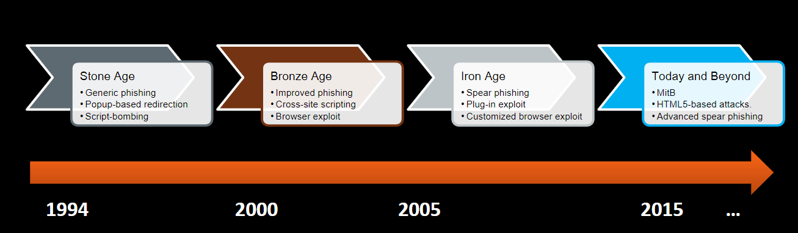
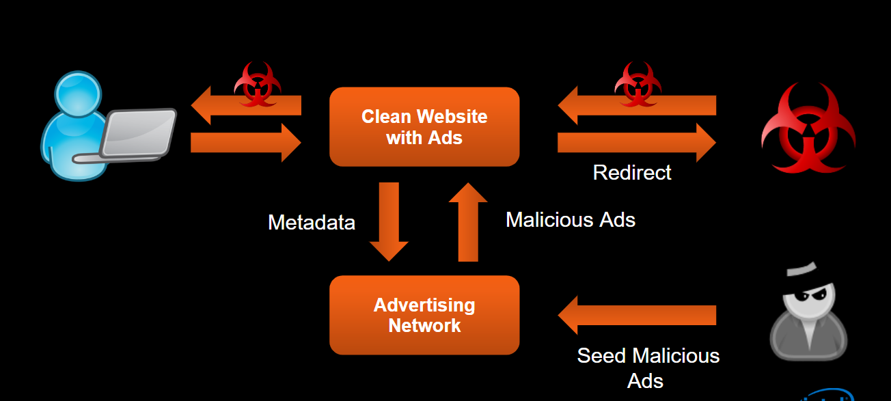
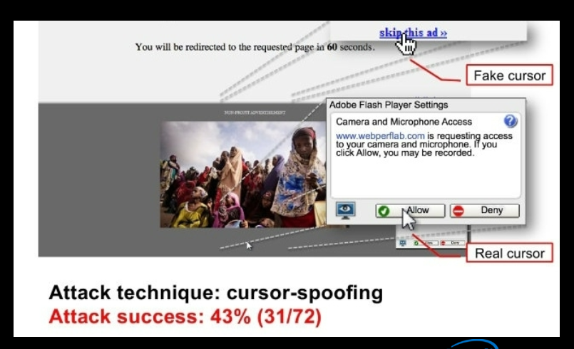

## Week 7 Write-Up
Week 7 focused on a general overview of web security whose content was provided by Cedric Cochin of McAfee Labs. Week 7's content consisted of basic Web fundamentals, the web as a threat delivery mechanism, web attack vectors plus common defenses, web as a threat delivery mechanism, anatomy of the modern user agent, and web security research tools. Content from week 7 is great at it truly shows a resource that by many can be taken for granted and the numerous dangers that can be presented in a tool that is widely used. 

### Oregon Law: Computer Crime 
On introduciton Cedrich immediately moved to defining what is a computer crime under Oregon state law. The definitions is as follows:

1. Knowingly accessing or using a computer or network (or attempting to do so) for the purpose of fraud; to obtain money, property, or services; or to commit theft of proprietary information.

2. Knowingly and without authorization altering, destroying, or damaging any computer, network, software, data, etc. (or attempting to do so).

3. Knowingly and without authorization using or accessing a computer or network (or attempting to do so).

- While the first two offenses may be charged as a Class C felony, the third offense is charged as a Class A misdemeanor. Conviction on either charge may result in a prison sentence, as much as one year for a Class A misdemeanor and as much as five years for a Class C felony.

Having knowledge of this definition is key as while developing web applications or attempting to exposing them does have consequences on various levels of extremity. Many malicious users fail to really recognize this when attempting to inject malware via some mechanism and when the law eventually strikes they could be unprepared. Seeing the development of law for software is also great as we know just how powerful software is since it is so strongly integrated into our lives that establishing some ground rules in necessary. 

### Evolution of the Web and Web-Based Delivery
Following the discussion of how the law has become established in the realm of software the discussion moved on to how the web has developed over time with a basis being set that HTTP (Hyper-Text Transfer Protocol) is the foundation of data communication for the web. Key components of the web consist of content, search engines, browsers, world wide web, Internet, networks, and computers. Having knowledge of these components is vital in the world of web security as various exploits can be attempted through various platforms and as technology develops so will the layers of the web allowing for new techniques or attempts to be introduced. The past concept can be seen in what are defined as the different ages of the web which can be seen in the following image (image provided by Cedric Cochin):

With such a wide use and an array of components the web is utilized to deliver ninety five percent of all malware developed therefore making this topic very relevant in modern industry and even within the lives of daily users whom of which are not in the industry itself. One of the next big steps in the web was the development of Javascript into the poweful language it has become today (especially in development of the web). With the integration of Javascript the web exprienced progress in the web browser component we have seen stronger web experiences however with that same integration there are even more injection points for malware to introduce itself. Common injection points are de-obfuscated content (browser/extensions), Javascript (script engine), raw html (WinInet, ETW/ETL), and HTTP proxy network layer. While the content for this section was very brief it should provide the standpoint that technology in the web is rapidly and constantly changing plus developing leading to constant changes from a network perspective therefore it is vital to stay up on modern technologies. 

### User-Level Attacks
User-level attacks in the context of web security are relative to the content provided to the user or tactics that manipulate the end user to either load the malware themselves or lead them to an endpoint that can enforce the malware automatically. Due to such high susceptibility on the user end, social engineering has become the prime platform for injecting malware to other machines/systems since it is the user who can still be tricked and give instant access to desired resources. A definition provided by Cedric on social engineering states "In the context of information security, refers to psychological manipulation of people into performing actions or divulging confidential information. A type of confidence trick for the purpose of information gathering, fraud, or system access, it differs from a traditional "con" in that it is often one of many steps in a more complex fraud scheme". Since users are the weak link in the network of interaction numerous methods such as phishing, SEO poisoning, fake AV's, social media link insertion, forum link insertion, and malvertising have been developing to utilize social engineering to deliver their intended malware.

#### Phishing 
Phishing, in essence, is a method of trying to gather personal information using deceptive e-mails and websites (not all content is sent via email). The overall goal is to trick the email or fake URL recipient into believing that the content is something they want or need — a request from their bank or a link that states going to a URL will provide discounts — and to click a link or download an attachment. Common phishing tactics are mimicking site/email content so that the user believes what is being presented, plus on visit to the malicious site certifications can be forged to trick the user into thinking that the site is secure, however, today most phishing sites tend to be short lived. 

#### SEO Poisoning
SEO poisoning (search poisoning) is another common web attack that integrates malicious sites with common trends in search engines (Google for instance) so that the malicious sites are being presented to the user due to utilizing trends and pointing to information that will increase the presentation of a specific web page due to its correlation to a given trend. Using the trends in such a way is known as 'gaming' the search engines relevance ruels which usually attribute related content, massive inbounding link, and relevant inbounding link. Most of the sites that are shown usually redirect to the desired malicious site the attacker set up for the user. 

#### Fake Updates & Fake AV (Anti-Virus)
Fake updates and AV's is as straightforward as it seems. They prey on the users intention of keeping an up-to-date or secure system by implementing pop-ups that closely or entirely mimic common pop-ups that are related to either common operating system pop-ups or anti-virus pop-ups. Fake ads as previously stated mimic the behavior of common pop-ups but on a separate abstract layer but from a UI perspective it can be difficult or impossible to distinguish. 

#### Social Media Attacks
While social media has been huge in connecting people across the world they have also given attackers another mean to prey on victims across the world. Attackers can utilize social media by creating fake accounts to interact with desired targets in order to develop a relationship which as a result could provide them information that would otherwise not be disclosed. Social media sites also allow for the sharing of hyperlinks or URL which can be used to lure users of the social media site to a malicious location or to a site that will redirect to a malicious source. Users can protect themselves by being wary of what is being presented to them and only allow those you know into your social media presence.

#### Malvertising 
Malvertising occurs when an attacker uses advertising networks as a mechanism for delivering malware and is very beneficial to attackers as it does not requiring the acquisition of resources or hosting of resources limiting the cost input for the attacker. Another massive benefit for attackers is that through this style is that the users will trust the content on a authentic site which releives the attacker from attempting to establish a relationship with their targets. A simple diagram of how malvertising works at a high level can be seen below (image provided by Cedric Cochin): 

#### Common Defenses
Since so many tactics have been developed to harm the user in the web domain there are some common defensive procedures that have been produced to help mitigate harmful situations. Common defenses established are URL/domain reputations systems for real-time protection in the browser, site certification services, client/gateway AV, safe URL shorteners, content provider education, and end user education. Education is one of the largest areas that should be pushed by companies as many technologies can be developed to help protect end users however if the end user is not aware of the dangers out their then they can still be susceptible to them. Plus with modern technology providing education on a large scale has become much more efficient allowing for the opportunity in education of malware. 

### Browser-Level Attacks
Browser-level attacks consist of an attacker using a browser or browser script engine exploit to present/inject malware into a user system. Browser-level attacks can also occur through third party implementations and plug-ins such as java software, Adobe Flash, and so on. Due to development of browser technology a number of security features can be seen in modern browsers such as content security policy enforcement, URL scheme access rules, Operating System isolation/sandboxing, redirection restrictions, content handling/sniffing, disruptive script handling, built-in evalutation clients, and so on. Browser exploitations occur when a browser downloads, renders, and executes a malicious web file that takes advantage of a known weakness in a given browser type. Most exploitations occur by user initiation or sometimes can happen through drive-by downloads which themselves usually occur from user action. Many users ask why security experts can't simply block the content being provided that is malicious and the hard aspect of this area is that Javascript itself can provide a solution in thousands of different ways. Attackers also use various obfuscation techniques such as renaming script variables to meaningless text, removing white space to create an unreadable script, self-generating code, heavy use case statements, and encryption methods. 

#### Man-in-the-Middle Attack (MITM)
Exactly the same style as discussed in the previous write-ups however the approach taken here utilizes a browser weakness to gain access to network traffic between two endpoints which can then be taken advantage of. Gaining this advantage throught the browser will still allow the attacker to provide mid-traffic assertion (via the network) through tactics such as DNS poisoning, ARP poisoning, or rogue router/proxy. 

#### Man-in-the-Browser Attack (MITB) 
Noted as the dangerous cousin to Man-in-the-Middle attacks, MITB attacks still manipulate traffic between end points but through the browser itself which can allow the attacker to change number mid-stream, sniff passwords, or even port-scan a user's network. Common methods for MITB attacks consist of payloads taking advantage of browser exploits, plug-in exploits, and new HTML5 features such as web workers/sockets. 

#### DNS Spoofing
DNS spoofing, otherwise known as DNS cache poisoning, consists of storing malicious IP's on a DNS server so that when a browser asks for an authentic IP/domain the server will return the malicious IP/domain since it has been poisoned with the malicious content. Browsers then usually fetch the content from the provided malicious IP using the correct host in HTTP header.

#### Clickjacking (UI Redressing) 
Clickjacking consists of attempting to trick the user in clicking a pre-determined link with a rendered HTML page which will lead to a malicious site or provide maliciou content. Much of the content in the HTML page is usually frames and layers (good at hiding the maliciou intent) which are utilized to confuse the user on sites that are completely legitimate/authentic. An example of clickjacking can be seen below (image provided by Cedric Cochin): 

#### SQL Injection
SQL injection is a code injection technique, used to attack data-driven applications, in which malicious SQL statements are inserted into an entry field for execution (e.g. to dump the database contents to the attacker). SQL injection exploit a security vulnerability in an application's software, for example, when user input is either incorrectly filtered for string literal escape characters embedded in SQL statements or user input is not strongly typed and unexpectedly executed. SQL injection is mostly known as an attack vector for websites but can be used to attack any type of SQL database. SQL injections are also not just limited to data as there are a number of SQL statements that can be used to access a systems files, query remote database connections, and even execute shell commands. 

#### Same Origin Policy Attack
Same origin policy is a core security feature in browsers that maps domains/IP's to the same origin based on scheme, host, and port of a URL. Same origin policy in essence controls DOM access between scripts running in the browser, XML requests, cookie access, and plug-in access. Removing same origin policy can occur should the attacker gain access via the client-side which can allow the attacker to remove the filters present in same origin policy so that they can redirect the user to a malicious source. 

#### Cross-Site Scripting (XSS)
Cross-site scripting is a security vulnerability typically found in web applications. XSS enables attackers to inject client-side scripts into web pages viewed by other users. A cross-site scripting vulnerability may be used by attackers to bypass access controls such as the same-origin policy. The non-persistent (or reflected) cross-site scripting vulnerability is by far the most basic type of web vulnerability. These holes show up when the data provided by a web client, most commonly in HTTP query parameters (e.g. HTML form submission), is used immediately by server-side scripts to parse and display a page of results for and to that user, without properly sanitizing the content. The persistent (or stored) XSS vulnerability is a more devastating variant of a cross-site scripting flaw: it occurs when the data provided by the attacker is saved by the server, and then permanently displayed on "normal" pages returned to other users in the course of regular browsing, without proper HTML escaping.

### Web-Malware Toolbox
In order to fight back the growing danger of web malware security researches have developed a number of tools/providers for analysis and prevention to attempt to learn new strategies as well as help protect the end users of the web. Some common tools/providers consist of:

- Alexa: provides web traffic data, global rankings, and other information on 30 million websites.As of 2018, its website is visited by over 3 million people every month for URL review.

- Archive.org: Internet archive that can be used to view/analyze site changes over time to determine the authenticity. 

- IPVOID: web application that checks an IP against a large list of IP blacklists. 

- CHECKSHORTURL: URL expander service for short URL services in order to determine original URL.

- SiteDossier: provides basic site information such as IP, parent domain, DNS servers, and inbound links. 

- Webutation: URL reputation clearinghouse that uses real-time user feedback/experience.

- Web Inspector: online web scanning tool that also provides a list of recent malicious sites. 

- Virus Total: online web scanning tool that analyzes URL's and hosted files. 

- Linux JWHOIS: Domain registration data client that can provide registrar, registration date, expiration date, and contact name of a given domain

- Linux Dig: DNS resolver utility which can provide SOA, 'A' records, MX records, CNAME records, NS records, AAAA records, and TXT records.

### Web-Malware Research Tools
Much like tools provided in order to protect the user a number of research tools have been developed to help understand the tactics and behavior of malware throughout the web. Research tools for web security consist of:

- PhantomJS: Headless browser used for script interaction and automated page interaction that allows for user defined callbacks.

- Burp Suite: graphical tool for testing web application security with features such as intercept/modify traffic, log resource requests, and spidering. 

- Web Scarab: web security application testing tool. It serves as a proxy that intercepts and allows people to alter web browser web requests and web server replies. 

- JSUnpack: open source command-line utility or service that detects exploits which target browsers and browser plug-in vulnerabilities.

- Firebug: open-source web browser extension for Mozilla Firefox that facilitated the live debugging, editing, and monitoring of any website's CSS, HTML, DOM, XHR, and JavaScript.

### URL Classification
URL classification identifies a URL to be either malicious or benign (safe) based on different learning methods using various features like on Lexical, host-based, link popularity, DNS, DNS fluxiness, Web page Content, Network and some special feature. The main purpose of classification is to identify malicious content before being served on a large scale and in manner that is more consistent that other methods of identifying malware. 

### Conclusion
Overall week 7 provided a brief yet strong overview of web security as a whole. Week 7 also served as a catalyst in a sense that while so many tools and features can be developed to protect end users, it is the users education on web malware that can utlimately decide just how safe a browsing experience can be. 

