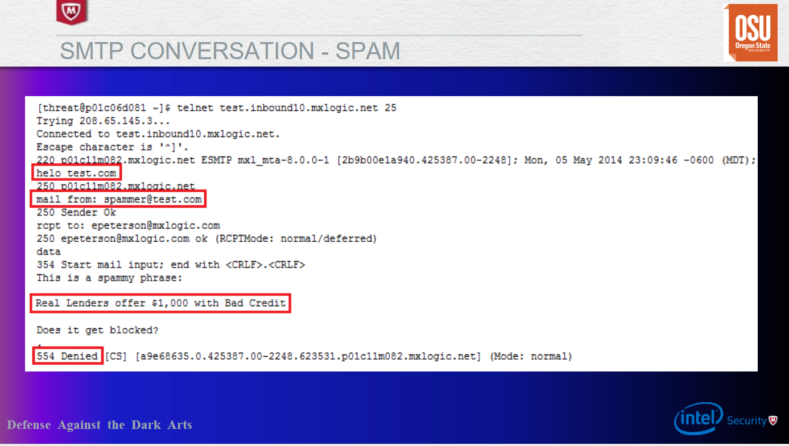

## Week 8 Write-Up
Week 8 focused on message security which was presented by Eric Peterson who is a research manager at McAfee Labs. Content for week 8 consisted of a brief overview of anti-spam/spam history, terminology, industry-standard technology/applications, and implementations of social engineering in spam/phishing.

### The Phishing Quiz
After his introdcution Eric began is lecture with a neat quiz developed by McAfee that was used to test other users and their capabilities to evaluate emails or messages to determine if they are legitimate or spam/phishing attempts. I really enjoyed the quiz that Eric and the McAfee provided as the questions and messages provided showed how difficult it can be to determine if a message is legitimate or spam as well as methods that can be used across devices such as checking the URL, domain that will be directed to, literature evaluation, and so on. While mostly being successful in the quiz the lesson learned is while we may be good at evaluating most spam/phishing all it takes is once to completely expose your own machine or system that you are associated with. 

### Terminology
Following the phishing quiz Eric then introduced a variety of terminology we should note when dealing with message security and for future discussion in the lecture. Here is the terminology Eric introduced us to:

- Spam: unsolicited junk email sent indiscriminately in bulk, often for commercial purposes. Much of it is sent by botnets, networks of virus-infected computers, complicating the process of tracking down the spammers. Most email today is actually spam. Below is an example of spam provided by Eric. 

- Ham: the complete opposite of spam, ham is legitimate messages sent to a user or machine or messages that is desired by a user or machine. These messages should not be classified as spam by spam engines/evaluators. Below is an example of ham provided by Eric.

- Spamtrap/Honeypot: A spamtrap is a honeypot used to collect spam. Spamtraps are usually e-mail addresses that are created not for communication, but rather to lure spam. Honeypot can be used to name the same type of trap as well since a spamtrap is a type of honeypot.In order to prevent legitimate email from being invited, the e-mail address will typically only be published in a location hidden from view such that an automated e-mail address harvester (used by spammers) can find the email address.

- Botnet: A botnet is a number of Internet-connected devices, each of which is running one or more bots. Botnets can be used to perform distributed denial-of-service attack, steal data, send spam, and allows the attacker to access the device and its connection. The owner can control the botnet using command and control software.

- Snowshoe Spam: a strategy in which spam is propagated over several domains and IP addresses to weaken reputation metrics and avoid filters. The increasing number of IP addresses makes recognizing and capturing spam difficult, which means that a certain amount of spam reaches their destination email inboxes.

- Phishing: Fraudulent attempt to obtain sensitive information such as usernames, passwords and credit card details by disguising oneself as a trustworthy entity in an electronic communication.Typically carried out by email spoofing or instant messaging which with user interaction will redirect to a malicious site or force a download to allow the attacker to gather sensitive data. 

- Spear Phishing: similar to phishing, however, spear phishing involves interacting with a targeted individual to gain personal or other confidential information. 

- RBL: Short for Realtime Blackhole List, a list of IP addresses whose owners refuse to stop the proliferation of spam. The RBL usually lists server IP addresses from ISPswhose customers are responsible for the spam and from ISPs whose servers are hijacked for spam relay.

- Heuristics: various algorithms and resources to examine text or content in specific ways. The word heuristic describes a type of analysis that relies on experience or specific intuitive criteria, rather than simple technical metrics. The use of high-level algorithms allows for heuristic analysis of content.

- Bayesian: Bayesian filtering helps a computer to recognize certain words and the likelihood that they're related to spam. In general, techniques like this involve training the machine to apply a higher-level analysis of content in order to filter out spam.

- Fingerprinting/Hashing: Forensic examiners rely heavily on hash-based techniques to quickly and efficiently screen the data for known objects. Recent research has considerably expanded the range of hash-based techniques to include adaptations of data-fingerprinting methods from other domains which includes identifying spam as fingerprinting and hashing can help identify during the inspection process since other manaul methods can be more extensive/expensive.

### Historic Cases
Now that we are knowledgable in terminology, Eric continued on discussing some of the more historic or well known spam/phishing cases that have happened during the course of the methods existence. One classic case was 419 phishing (419 comes from the international phone code that makes this illegal, also called the Nigerian Prince Scam) which is a typical African prince/princess stating a relative has passed and money will be donated if the user sends money to them this type of spam was very common in the 80's via actual manual mail. Tactics like this also utilized long phishing which will provide resources stated for some users then phish others who fall to the spam due to the few positive results. The Canadian Pharmacy is another classic which is given the name due to the high volume of spam to Canadian pharmacy's which would attempt to trick the user into purchasing medication at a low price (this phish also showed a rise in effort to increase persuasion). Pump' N 'Dump is yet another classic where spammers offer insider tips or offer stocks then dump the values in order to harm businesses (usually smaller businesses targeted). Botnets were also discussed where they dominated around 2010 with spam (which was most email those days) and where botnets gathered significant amount of money value over time however such infamous action lead to limelight and a decrease in activity or botnet takedowns. While most have been handled and declined in volum through recent events the botnets infected numerous machines and are now on the rise. An example of the Canadian Pharmacy spam can be seen below (image provided by Eric Peterson):

### Technology & Tools
In order to combat spam a number of technologies and tools have been developed to help identify spam and filter it from entering user email repositories to protect them from potential harm. Technology for spam is usually broken into two areas which are reputation-driven and content-drivent. Reputation-driven revolves around IP's, Message themselves or applications, plus URL's and how each is evaluated and rated on user feedback or technologically driven reputation engines. Content-driven is centered on common strings, fixed strings vs. variable strings, message attributes, combination of strings and attributes (meta-rules). Tools for spam consist of Linux tools such as DIG which is used for querying DNS records, WHOIS for IP and domain registration information, grep/SED/AWK for data parsing and manipulation. Tools also consist of open-source databases (PostgreSQL, MySQL), Regex Coach for evaluating content with regular expressions, Trustedsource.org which holds historical information on previous and current reputations whose data is provided by McAfee, and Spamhaus.org which is widely accepted as an authoritative source of reputation data. Example of tools being used can be seen below (image provided by Eric Peterson):   

The lab was very intriguing and being introduced to Regex Coach was quite the learning experience however is very useful to know. Using regular expressions allows us to evaluate numerous pieces or compare strings of content provided in a message which through the course of the lab was the main point followed by improving the regular expression as any gain in percentage is massive in identifying spam. when evaluating messages there are two primary methods mentioned for analyzing the content: probability scoring and additive scoring. Additive scoring is developing a point threshold for whether a messageshould be classified as spam, and then adjust the points based on various factors disovered about the email. Probability scoring is idenitifying the programs confidence on whether something is spam based on various indentified parameters that are common or known to spam. Overall the lab was a great way to introduce students to technology used within this space of security as well as common methodologies implemented to create an effective evaluation process. 

### Research Techniques
Techniques for dealing with spam consist of methods such as parsing, grouping, aggregation, and identification of outliers. Parsing handles with extraction of key meta data (Source_ip, Subject, Mail_from, HELO, etc). Grouping collects spam into units based on imestamp, source_ip or cidr, subject, URL, other common elements. Aggregation which will utilize values or time and use that data for evaluation to extract counts, distinct counts, sums, and so on to find patterns of values that can be used to help classify spam or can expose relevant research paths. Identification of outliers is finding unique aspects between messages that separates one another from being spam or ham and using that found knowledge to increase search productivity or rules. While using and creating techniques there are some considerations to make when detecting spam. One aspect to consider is how much human input is required in evaluating content and how much time that can save the quality of the work and the value of manual compared to automating it. When to fully automate the process which can include thinking about the resource cost to develop, and the fault tolerance/resiliency or possibly going to a combination of both human interaction and automation. Also determining by probability scoring or additive scoring or a mixture of both can be huge in filtering spam. 

#### Data Scientific Method
Below is an exerpt from one of Eric's favorite books on data discussing a scientific method related to data-science: 

### Conclusion
Week 8 was a good experience to have in the realm of security as I believe many people take the evaluation of spam for granted since it is well evaluated today plus with the abuse of spam it has become ingrained into society as an obvious annoyance that if mistaken can lead to dire consequences. From this week we also learned valuable tools and validation methods for spam that will be useful heading forward as everyone with some form of messaging will come across some form of spam or phishing in their lifetime. While I was unable to do the last lab due to struggles with the VM seeing how evaluation was handled was really neat and provided a good experiences as to how much of a gray area it can be. 

